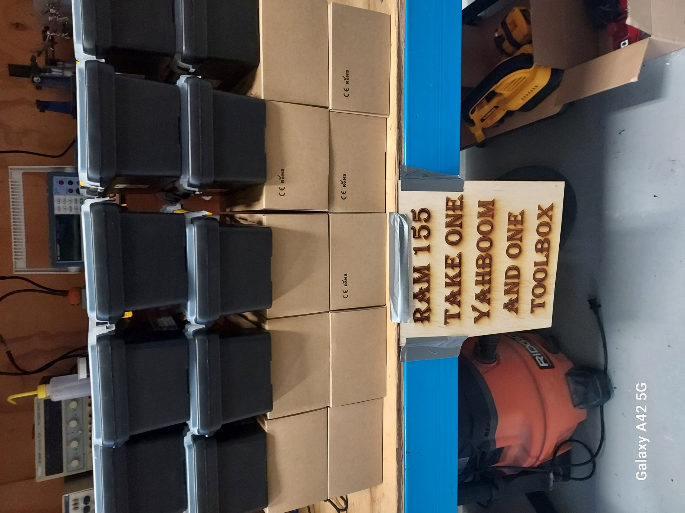
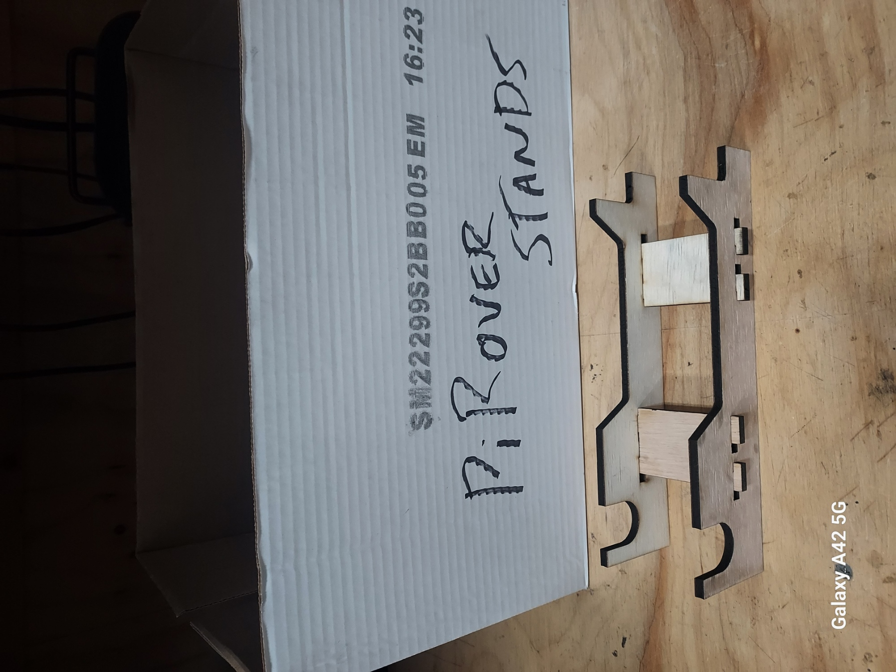
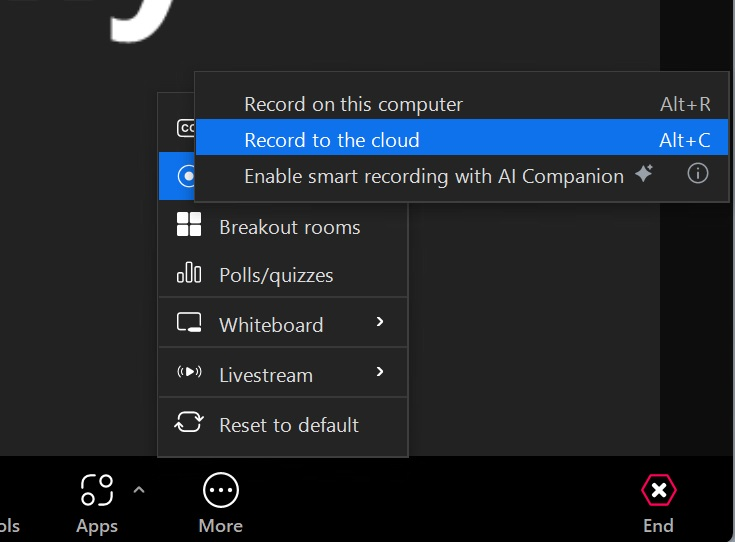
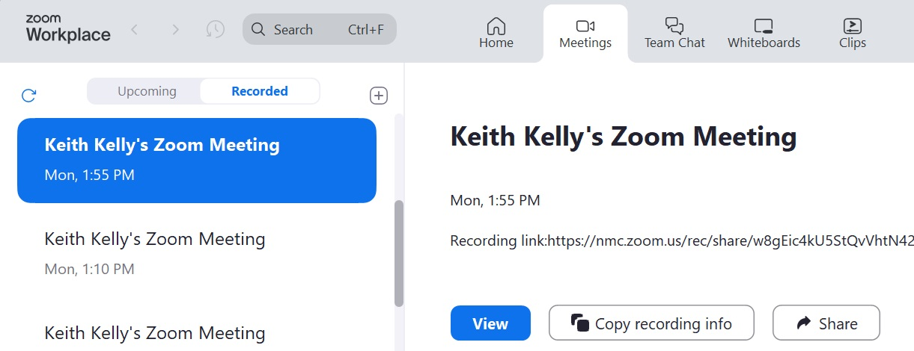

## piRover Builds by K2 - Course 1:Python

### [piRover01](../../) - [Sprint 1](../) - Week 01

W01 - This weeks is about introductions. You'll be introduced to the course, the Raspberry Pi, and the piRover. You'll create your first video and submit either directly to Moodle or via a link (YouTube channel?). Pick up your piRover kit and you can get started on next week's build!

**Session 1**
- Welcome and Course Introduction
    - Ethernet connection is required for week 2
    - Do you need to purchase an Ethernet adapter?
- [Raspberry Pi 4 Getting Started](../../lessons/01/RaspberryPi4GettingStarted.pdf){:target="_blank"}
    - *Assigned* [Raspberry Pi 4 Getting Started](../../lessons/01/RaspberryPi4GettingStarted.Activity.docx){:target="_blank"}
- [Introduction to the piRover](../../lessons/02/piRoverIntroduction.pdf){:target="_blank"}
    - Pick up your RAM kit!
    - Take a look around the makerspace!

- Zoom video - a first try
    - sign in to MyNMC
    - launch Zoom
    - start "My personal meeting" (you're all alone!)
    - Join with computer audio
    - Record to the cloud 
    - 
    - End meeting
    - Check "Recording" tab and test recording link.
    - 
    - return to class Zoom to discuss

**Session 2**

<!-- - Zoom account? 
    - Were you able to join as a Zoom user?
    - Can you create a Zoom video recording?
        - Local Storge
        - Cloud Storage
    - Troubleshooting
        - Create a screen capture of your Zoom window showing controls.
        - Paste the image into an email to me (kkelly@nmc.edu)
        - Provide the following information
            - What type of machine are you on?
                - NMC computer
                - my laptop (PC)
                - my laptop (Mac)
                - other?
            - Is the Zoom app install?
            - Did you log into Zoom with your mail.nmc.edu account name?
            - Anything else that you've have tried?

- Managing Project Files in the Cloud (Demo on submitting)
    1. Create RAM155/Week01
    2. Upload Raspberry Pi worksheet
    4. Add .mp4 file if you recorded the video locally (cloud preferred)
    4. Download folder as .zip
    5. Submit .zip file to W01 link
    6. Did you record to the cloud?
        1. Week01.zip has only one file - the Pi worksheet
        2. Add zip to W01 link
        3. Copy link to cloud video in text area.

- [Introduction to the piRover](../../lessons/02/piRoverIntroduction.pdf){:target="_blank"}
    - [RAM155 student kit Bill of Materials (BOM)](../../RAM155_kit_BOM.pdf)
        
        
- Build process
    - [piRover Build Preparation](../../lessons/05/piRoverBuildPreparation.pdf){:target="_blank"}
    - [Introduction to Agile/Scrum](../../lessons/06/piRoverScrumStandup.pdf){:target="_blank"}
    - [piRover Build (intro)](../../lessons/07/piRoverBuild.pdf){:target="_blank"}
    - **Requirement for next week!**
        - Build video 1 - at half way point in build answer the following
            - What have you completed? Show your rover.
            - What work is remaining in the build?
            - What obstacles or challenges did you have so far?
        - Build video 2 - at completion
            - Show the rover
            - How long did it take to build
            - What were major obstacles or what was difficult
            - What would you do differently next time -->

---

### Assignments

**W01** Assignments - Zip assignment files specified in the following activities and submit to the link below.

- [**Raspberry Pi 4 Getting Started**](../../lessons/01/RaspberryPi4GettingStarted.Activity.docx){:target="_blank"}
- **Your introduction video** (link or file)
- *Note*: piRover build activities are started this week but not due until next week. Be sure to create your first video when the first half of your build is completed. Both video 1 and video 2 are submitted in week 2.