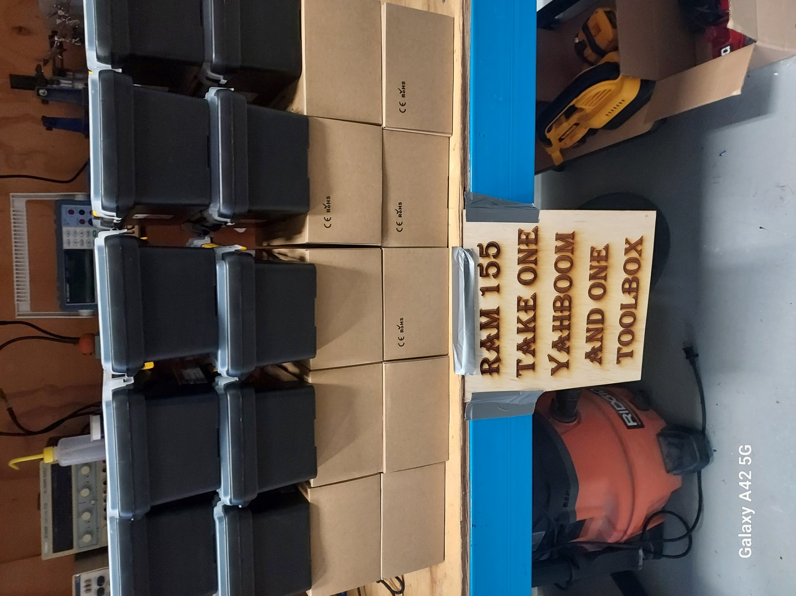
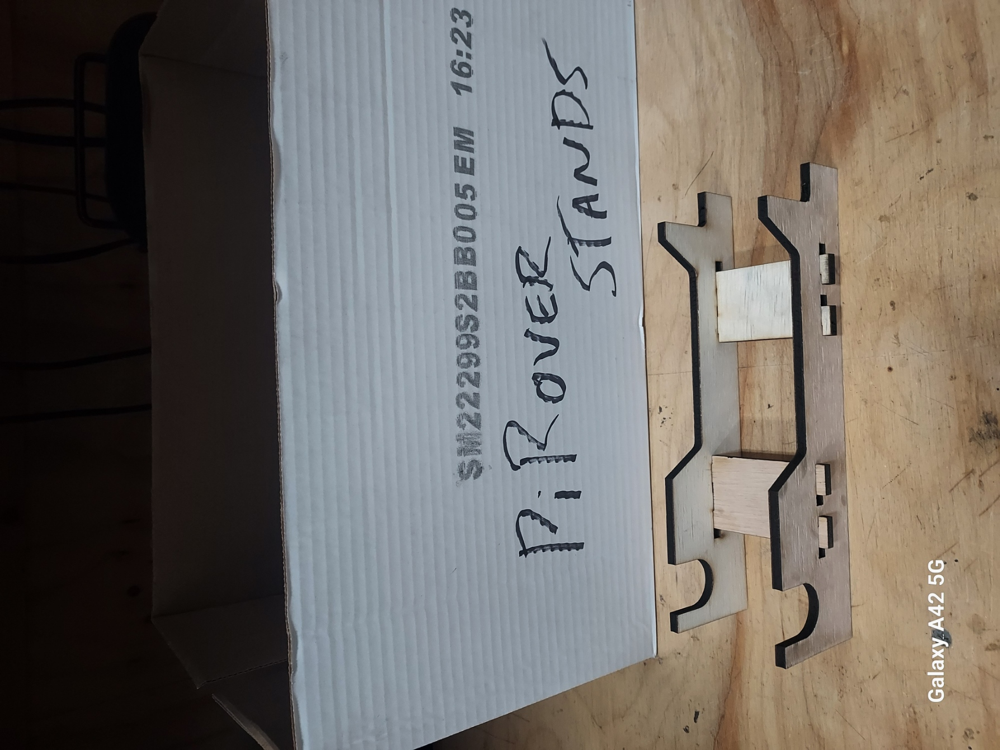

## piRover Builds by K2 - Course 1:Python

### [piRover01](../../) - [Sprint 1](../) - Week 01

W01 - This weeks is about introductions. You'll be introduced to the course, the Raspberry Pi, and the piRover. You'll create your first video and submit either directly to Moodle or via a link (YouTube channel?). Pick up your piRover kit and you can get started on next week's build!

**Session 1**
- Welcome and [Course Introduction](../../course_info/CourseIntro-NMC.pdf){:target="_blank"}
- [Raspberry Pi 4 Getting Started](../../lessons/01/RaspberryPi4GettingStarted.pdf){:target="_blank"}
    - *Assigned* [Raspberry Pi 4 Getting Started](../../lessons/01/RaspberryPi4GettingStarted.Activity.docx){:target="_blank"}
- [Introduction to the piRover](../../lessons/02/piRoverIntroduction.pdf){:target="_blank"}
- *Assigned* Learning to use Zoom video. Introduce yourself by creating a short introduction video using your name as the file name. Include in this week's zip file. This video will not be shared.
- Pick up your RAM kit!
- Take a look around the makerspace!

**Session 2**

<!-- - Zoom account? Where you able to join as a Zoom user?
- Zoom video recording?  Local or cloud storage?
- My test
  - [Cloud](https://nmc.zoom.us/rec/share/ - [local](video1437989670.mp4)
  - [Cloud](https://nmc.zoom.us/rec/share/dPG2JdQd1PrKjTGkg-CoMR6vTOTE8pll0Ovui1PilPI1PEPPXT08OIP0UZnl0SPL.hMTnhak94264Cuo4)

- Managing Project Files in the Cloud
    1. Create RAM155/Week01
    2. Upload Getting Started activity doc
    3. Upload Student Intro doc
    4. Add .mp4 file if you recorded the video locally (cloud preferred)
    4. Download folder as .zip
    5. Submit .zip file to W01 link
    6. Add link to video if you recorded to the cloud (preferred)

- Build process
    - [piRover Build Preparation](../../lessons/05/piRoverBuildPreparation.pdf){:target="_blank"}
    - [Introduction to Agile/Scrum](../../lessons/06/piRoverScrumStandup.pdf){:target="_blank"}
    - [piRover Build (intro)](../../lessons/07/piRoverBuild.pdf){:target="_blank"}
    - **Requirement for next week!**
        - Build video 1 - at half way point in build answer the following
            - What have you completed? Show your rover.
            - What work is remaining in the build?
            - What obstacles or challenges did you have so far?
        - Build video 2 - at completion
            - Show the rover
            - How long did it take to build
            - What were major obstacles or what was difficult
            - What would you do differently next time -->

---

### Assignments

**W01** Assignments - Zip assignment files specified in the following activities and submit to the link below.

- [**Raspberry Pi 4 Getting Started**](../../lessons/01/RaspberryPi4GettingStarted.Activity.docx){:target="_blank"}
- **Your introduction video** (link or file)
- *Note*: piRover build activities are started this week but not due until next week. Be sure to create your first video when the first half of your build is completed. Both video 1 and video 2 are submitted in week 2.