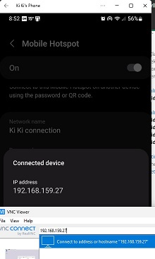

## piRover Builds by K2 - Course 1:Python

### [piRover01](../../) - [Sprint 1](../) - Week 04

W04: In week 4, we start the transition from running someone else's code to writing our own. First, you'll connect remotely to the Pi and take a first look at Python on the Pi. We'll then disable the Yahboom code and start writing our own GPIO code.

**Session 1**

- [Connecting Remotely](../../lessons/11/CreatingARemoteConnection.pdf){:target="_blank"}
  - Connect to your remote desktop
    - Option 1: Ethernet - connection is peer-to-peer
      - *piRover.local* is the VNC server name
    - Option 2: Network/Wi-Fi connection 
      - Raspberry Pi and your workstation share the same network
      - *piRover* is the VNC server name
      - NMC network does not support
      - But we have set up *nmc_makers* open access point in the makerspace. 
      - Enter the pass code for your Wi-Fi access point (AP). Again, the nmc_makers AP is open. No pass code is required
    - Use a smartphone hotspot? This may be the best option if it is available to you. Once you have connected the Pi, you can view the connection on your phone. The IP address is normally available.
    - Hover or Wi-Fi icon in menu bar - your IP address is displayed
    - Test Internet connectivity in a terminal window
      - ping 8.8.8.8    (ctrl+C to exit)
      - ping google.com (ctrl+C to exit)

  - **Use must be remotely connected this week!**
    - Access assistance in the makerspace. See the tools section for tech schedule.

- The remote desktop
  - Menu
  - Browser
  - File Explorer
  - Terminal emulator
  - Power issues
  - Updates?
  - Networking/Wi-Fi

- Browser shortcuts
  - Moodle
  - Google Drive

- An introduction to the Linux command line.
 - [Introduction to Linux and Basic Linux Commands for Beginners](https://www.youtube.com/watch?v=IVquJh3DXUA&ab_channel=sakitech){:target="_blank"}  by sakitech
  - [Linux Essentials Tutorials: A Beginner’s first 100 commands](https://factorpad.com/tech/linux-essentials/index.html) by FactorPad

- RAM 155 workspace on the Pi
  - create piRover directory
  - create week04 directory

- A first look at Python
  - Download Yahboom Python examples - See Tools section
  - Extract Yahboom examples to home directory (~)
  - Demo - running Python from terminal prompt

- A first look at Visual Studio Code
  - Copy ColorLED.py to week04 folder
  - Run. Issues?
  - VS code investigation
 
**Session 2**

**Announcements**
> Week 05 Session 2 (next week): End of Sprint Project 1 is completed on your own. No Zoom session that day. Open the Week 05 link, complete the required coding, and submit your work by end of Session 1. The class will review Project 1 coding the following week.
> #### Requirements:
> 1. Access your remote desktop.
> 2. Open and use VS Code to write and run code.
> 3. Refer to prior code examples. Copy code and duplicate patterns. 
> 4. Reference documents and class notes to determine GPIO pins.
> 5. Take a screen capture of your code window.
> 6. Zip your code along with screen capture and submit to Moodle.
> 7. All Sprint 1 technical debt must be submit by the end of Week 05. No late credit is available after.

- Build Validation review - issues? Does everything work?
  - [Build Validation 1](../../lessons/13/BuildValidationPart1.pdf){:target='_blank'}?
  - Build Validation 2?
  
- Remote connections - Status? 
  - via Ethernet (connect to piRover.local)
  - have your home Wi-Fi connected?
    - no Ethernet cable required
    - connect to piRover
  - Smartphone Hotspot is also a good option
    - The IP address of your piRover is visible
    
    - Connect via VNC using the IP address rather than piRover
  - Connecting via nmc_makerspace
    - new nmc_makerspace Wi-Fi access point
    - workstations can connect to nmc_makersapce
    - connect your rover using direct connection (Monitor, Keyboard, Mouse)
    - Or, new SD card is configured to automatically connect to nmc_makerspace AP.

- Remote Desktop Review
  - piRover Browser
    - Google Drive
    - Moodle (elearn.nmc.edu)


- Linux - basic commands

| Command | Operation |
|---------|-----------|
| ls      |Displays information about files in the current directory. |
| pwd     |Displays the current working directory.|
| mkdir   |Creates a directory.|
| cd      |To navigate between different folders.|
| rmdir   |Removes empty directories from the directory lists.|
| cp      |Moves files from one directory to another.|
| mv      |Rename and Replace the files|
| rm      |Delete files|

- Python coding using Visual Studio Code
  - Open VS Code using the terminal prompt
  
  ```console
  cd piRover
  code .
  ```

  - Review of ColorLED.py (see week04 assignments)
    - VS code investigation
    - Run code using toolbar or F5

  - Removing the Yahboom code conflict
    - [Disabling Yahboom Bluetooth](../../lessons/21/DisablingYahboomBluetooth.pdf){:target='_blank'}

  - Single stepping using the debugger

<!-- - [RPi.GPIO library](https://sourceforge.net/projects/raspberry-gpio-python/){:target='_blank'}
  - This resource is installed on Raspian OS by default.

- [Blink with VS Code](../../lessons/22/piRoverBlink.pdf){:target='_blank'}

```bash 
wget https://k2controls.github.io/piRover01/lessons/22/blink.py
```
- Create beep.py and test
- Create blink_beep.py and test

- Saving piRover code to your cloud storage
  - Copy files listed in Assignments to week04 in your Google Drive.
  - Download the week04 folder to your workstation.
  - Submit the resulting week04.zip file to the Moodle assignment link. -->
 
---

### Assignments
- **W04** Assignments - Zip assignment files specified in the following activities and submit to the link below
  - **ColorLED.py**
  - ~~**blink.py**~~
  - ~~**beep.py**~~
  - ~~**blink_beep.py**~~

  