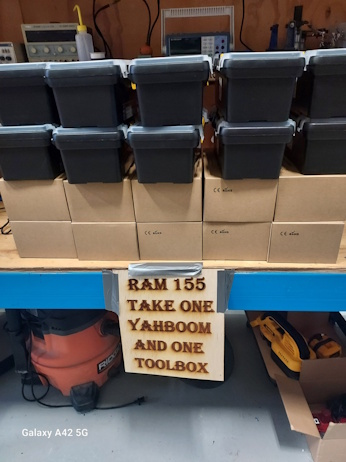
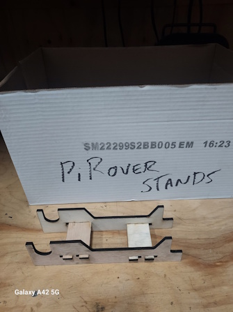
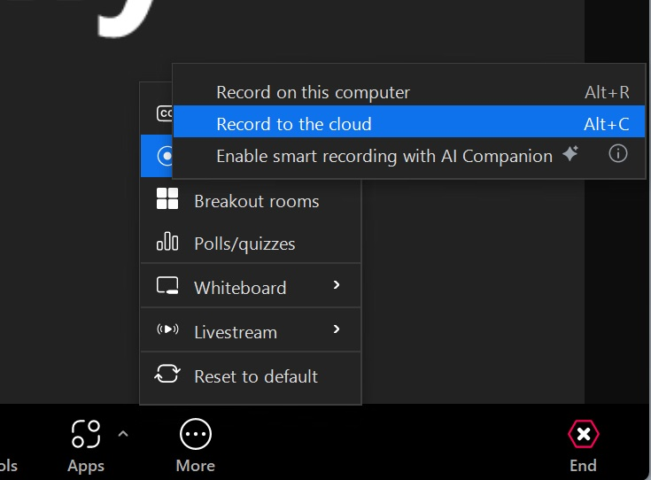
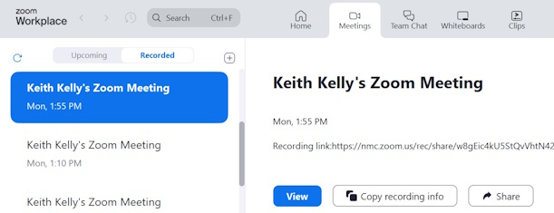
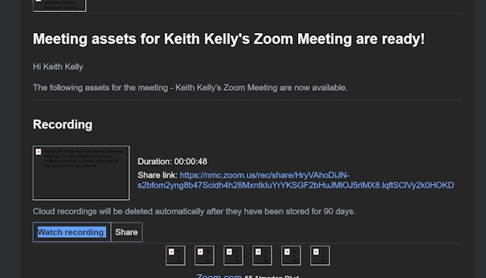
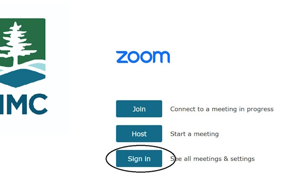
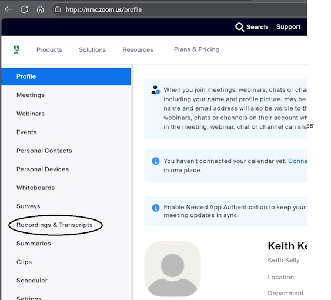

## piRover Builds by K2 - Course 1:Python

### [piRover01](../../) - [Sprint 1](../) - Week 01

**Session 1**
- Welcome and Course Introduction
    - Ethernet connection is required for week 2
    - Do you need to purchase an Ethernet adapter?
- [Raspberry Pi 4 Getting Started](../../lessons/01/RaspberryPi4GettingStarted.pdf){:target="_blank"}
    - *Assigned* [Raspberry Pi 4 Getting Started](../../lessons/01/RaspberryPi4GettingStarted.Activity.docx){:target="_blank"}
- [Introduction to the piRover](../../lessons/02/piRoverIntroduction.pdf){:target="_blank"}
    - Pick up your RAM kit!
    - Take a look around the makerspace!

- Zoom video - a first try
    - sign in to MyNMC
    - launch Zoom
    - start "My personal meeting" (you're all alone!)
    - Join with computer audio
    - Record to the cloud 
    - 
    - End meeting
    - Check "Recording" tab and test recording link.
    - 
    - return to class Zoom to discuss

**Session 2**

- Zoom account? 
    - Were you able to join as a Zoom user?
    - Can you create a Zoom video recording?
        - Cloud Storage is always preferred

- Submitting Week 1 (W01) work - demo
    1. Last session - we  created courses/RAM155/Week01 folder
    2. Last session - we upload Raspberry Pi worksheet
    3. On your own - complete the worksheet
    4. Download the week01 zip from G-Drive. See class demo
    5. Submit to W01 assignment link
    6. Create welcome Zoom video.
    7. Paste link into W01 video assignment link
        1. See your email from Zoom
        
        2. Sign in to Zoom to see all of your recording
        
        

- [Introduction to the piRover](../../lessons/02/piRoverIntroduction.pdf){:target="_blank"}
    - [RAM155 student kit Bill of Materials (BOM)](../../hardware_kit/RAM155_kit_BOM.pdf)
        
        
- Build process
    - [piRover Build Preparation](../../lessons/05/piRoverBuildPreparation.pdf){:target="_blank"}

    <!-- - [Introduction to Agile/Scrum](../../lessons/06/piRoverScrumStandup.pdf){:target="_blank"} -->
    
    - [piRover Build (intro)](../../lessons/07/piRoverBuild.pdf){:target="_blank"}
    - **Requirement for next week!**
        - Build video  - at completion
            - Show the rover
            - How long did it take to build
            - What were major obstacles or what was difficult
            - What would you do differently next time

---

### Assignments

**W01** Assignments - Zip assignment files specified in the following activities and submit to the link below.

- [**Raspberry Pi 4 Getting Started**](../../lessons/01/RaspberryPi4GettingStarted.Activity.docx){:target="_blank"}
- **Your introduction video** (link to Zoom cloud recording)
- *Note*: piRover build activities are started this week but not due until next week. Be sure to create your video when your build is completed. Build video is submitted in week 2.