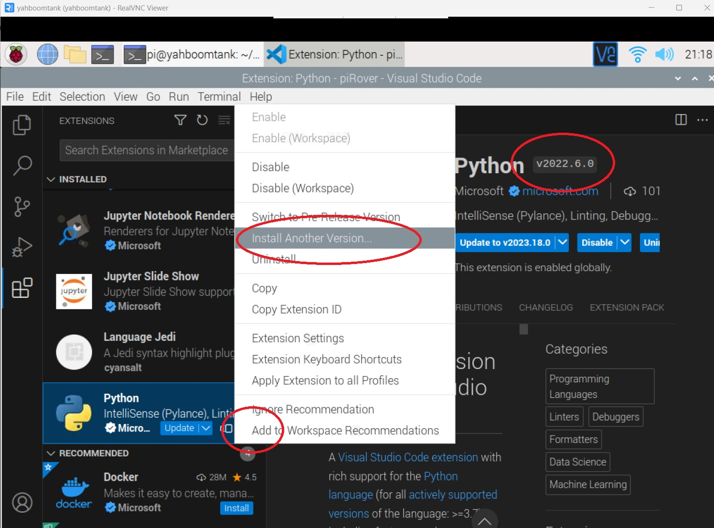

## piRover Builds by K2 - Course 1:Python

### [piRover01](../../) - [Sprint 1](../) - Week 05

This is the end of Sprint 1. There is no class session during Session 1. This class time is allocated to completing the Project 01 coding. Be sure to submit your Project 1 code by the end of Session 1. The P01 submission link will be disabled at the end of class time. See the P01 link on the Moodle page.

**Session 1**
- **No Zoom class session** - Project 1 coding on your own.

- **Project 1**
  - Create a stop light simulation using the RGB LED provided in the piRover. This is a final assessment for Sprint 1. Do your own work and do not get assistance.
    - Consider typical timing for a stop light red, green, amber sequence.
    - Research RGB colors. How do you create amber with RGB? Use prior class and Yahboom resources to determine.
    - Use class and Yahboom resources to determine GPIO pins associated with red, green, and blue LEDs.
    - Create p01_traffic_light.py file in your week05 folder. Use blink and beep code from the prior week as a guide.
    - Run your solution and test.
  - Submit your code to the P01 link on Moodle by the end of the Session 1 class period.

**Session 2**

- End of Sprint 1
  - Technical Debt
    - Zip and submit all outstanding Sprint 1 assignments and submit to the Debt01 link
      - Full credit is provided for all late work for this sprint only. P01 is an exception.

  - Complete the Sprint 1 Retrospective. 
    - See link Retro01 link on Moodle page.
      - What do you like about the course so far? What should be continued?
      - What is one thing that you'd change? What can be improved?
      - Enter responses directly into Moodle using the "Add submission" button. 
  - Grade as of Sprint 1 will be displayed after the Week05 deadline.

- Fixing Jedi Error
  - Follow along with the instructor as an earlier version of VS Code is installed.
  
  
- Review and prepare for Sprint 2 lab checks.
  - Review prior Session recordings as required.
  - Practice creating Zoom videos. No submission is required for Week 05.
  - Review the [Blink with VS Code](../../lessons/22/piRoverBlink.pdf){:target='_blank'} lesson.
  - Review use of hardware manual.
  - Review Week04 codeing - blink.py, beep.py, blink_beep.py 
  - Review use of debugger and single step.
    -  Set a breakpoint at the start of the program and single step the execution.
      - Use your video camera to show the code running on the rover. (LED is blinking).
      - Set a break point and run the code again. 
      - Use screen share feature to show the code being single-stepped through the light cycle.
  - Review copying your code to your cloud drive and zipping your code to submit.
    - Verify that you can submit video either as a mp4 file included in your zip file or as a Zoom link.

---

### Assignments
**W05** Assignments - This is an assessment week. Complete Project 1 along with retrospective and any technical debt. Refer to class notes on completing debt and retrospective. 
- **P01** (submitted during Session 1)
- **Retro01**
- **Debt01**

  