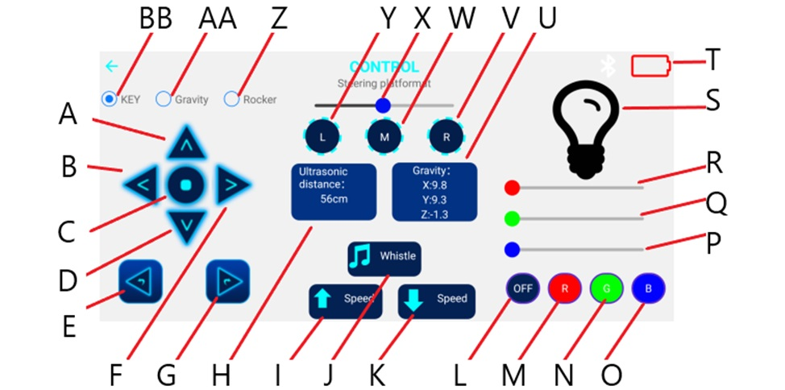
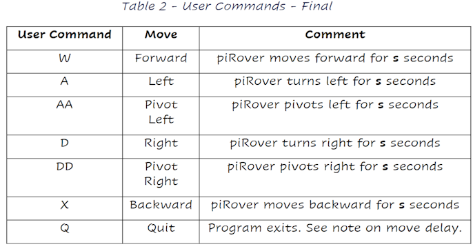

## piRover Builds by K2 - Course 1:Python

### [piRover01](../../) - [Sprint 3](../) - Week 11

W11: This week's focus in Pulse Width Modulation. This type of output provides an output pulse with the ability to control the duration of the pulse. This creates an analog value that can be used to dim an LED or control motor speed. 

**Session 1**
- Project 02 - User Move - solution/review on Wednesday

- [Pulse Width Modulation (PWM) Introduction](../../lessons/30/PulseWidthModulationIntro.pdf){:target='_blank'}

```
wget https://k2controls.github.io/piRover01/lessons/30/pwm_intro.py
```

- Variable Scope
  - Scope Demo 1
  - Scope Demo 2

- Demo - Motor Speed Control 
  - use earlier start demo code - see week10
  - add speed ramp

- **Sprint 3 Plan**
  - Step 1 Keyboard interface
  - Step 2 Fake modules and wiring
  - Step 3 Module implementations
  - Step 4 Bluetooth interface replaces keyboard

- Partner Activity - [Keyboard Interface Design](../../lessons/32/KeyboardInterfaceDesign.docx)
    - Submit a Keyboard Interface document (.docx or .pdf) that specifies your vision for a keyboard interface for all piRover functions available on the smartphone Control interface. Use the following image to identify required functions/user interface elements.
    
    - Include additional moves [shown here](../../lessons/32/tank_drive_images.pdf){:target='_blank'}
    - Include speed control - set speed?

  
**Session 2**

- [Project 02 - User Move](../../projects/P02/P02UserMove.pdf){:target='_blank'} 
    

- Review your Keyboard Interface Design (.docx or .pdf) from Session 1.


- Open the piRover solution on your Pi and create the final weekP03 directory. This folder will contain project code for the remainder of the semester.

- Create your piRover_keyboard.py file based on your planning document. The instructor will get you started.
  - extend to include all actions specified in the table above. Use key values that you specified in your Keyboard Interface Design document.
  - Add key inputs for slider controls but don't be concerned with the additional analog slider value that will eventually be required. We'll work on this next week.
  
- Create/connect piRover_drive_fake.py
  - test fake implementation 
  - add speed functionality as time permits.


---

### Assignments
- **W11** Assignments - Zip assignment files specified in the following activities and submit to the link below
    - **Keyboard interface document**
    - **piRover_keyboard.py**
    - **piRover_drive_fake.py**
